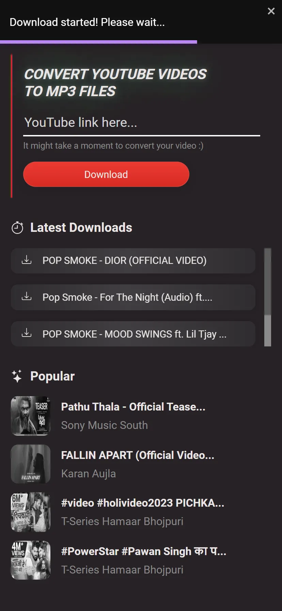
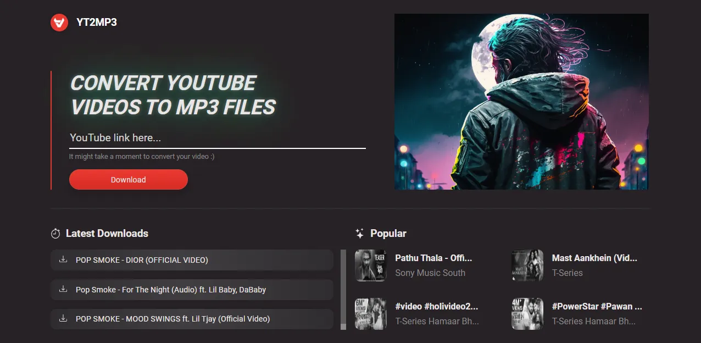
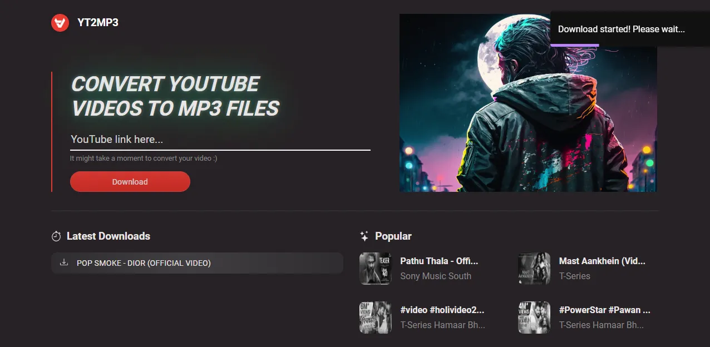

<h1 align="center">YouTube 2 MP3 Downloader</h1>

<ul>
    <li><a href="#english-documentation">English documentation</a></li>
    <li><a href="#documentacao-em-portugues">Documentação em português</a></li>
</ul>

<hr>

<h1 id="english-documentation">English Documentation</h1>

<h2>📜 Table of content</h2>

<ul>
    <li><a href="#about-the-project">About the project</a></li>
    <li><a href="#live-demo">Live demo</a></li>
    <li><a href="#features">Features</a></li>
    <li><a href="#front-end">Front-end</a></li>
    <ul>
        <li><a href="#layout">Layout</a></li>
        <li><a href="#technologies-front">Technologies</a></li>
    </ul>
    <li><a href="#back-end">Back-end</a></li>
    <ul>
        <li><a href="#external-apis">External APIs</a></li>
        <li><a href="#technologies-back">Technologies</a></li>
    </ul>
    <li><a href="#how-to-set-up">How to set up</a></li>
    <li><a href="#inspirations">Inspirations</a></li>
    <li><a href="#author">Author</a></li>
</ul>

<h2 id="about-the-project">💻 About the project</h2>

<p>
    YouTube 2 MP3 Downloader is a responsive application that lets you convert and download YouTube videos into MP3 files. The app also features a selection of popular music that is currently trending, making it easier to download them without even having to copy the link.
</p>

<h2 id="live-demo">🌐 Live demo</h2>

<p>
    Check out this project running on <a href="https://yt-2-mp3.netlify.app/">Netlify</a>
</p>

<h2 id="features">🔎 Features</h2>

<ul>
    <li>Converts and downloads YouTube videos into MP3 files</li>
    <li>Lists currently trending songs, allowing the user to download them with a single click</li>
</ul>

<h2 id="front-end">Front-end</h2>

<p>
    The client-side of <b>YouTube 2 MP3 Downloader</b> was built with React + Typescript.
</p>

<h3 id="layout">📐 Layout</h3>

<h4>Mobile</h4>

<div style="display: flex; gap: 0.2rem">
    
    
</div>

<h4>Desktop</h4>

<div style="display: flex; gap: 0.2rem">
    
    
</div>

<h3 id="technologies-front">🔨 Technologies</h3>

<p>
    The following technologies were used to build YouTube 2 MP3 Downloader front-end:
</p>

<ul>
    <li>
        <a href="https://www.npmjs.com/package/axios">axios</a> - For API calls
    </li>
    <li>
        <a href="https://www.npmjs.com/package/react-device-detect">react-device-detect</a> - For small responsive tweaks
    </li>
    <li>
        <a href="https://www.npmjs.com/package/react-icons">react-icons</a> - For icons
    </li>
    <li>
        <a href="https://www.npmjs.com/package/react-loading-skeleton">react-loading-skeleton</a> - For neat skeletons
    </li>
    <li>
        <a href="https://www.npmjs.com/package/react-toastify">react-toastify</a> - For general dialogs
    </li>
</ul>

<h2 id="back-end">Back-end</h2>

<p>
    The server-side of YouTube 2 MP3 Downloader was built with Node + Typescript. Some data was also cached with Redis to improve performance.
</p>

<h3 id="external-apis">💱 External APIs</h3>

<p>
    The following third-party APIs were used on YouTube 2 MP3 Downloader:
</p>

<ul>
    <li>
        <a href="https://rapidapi.com/ytjar/api/youtube-mp36">YouTube MP3</a> - For MP3 conversion
    </li>
    <li>
        <a href="https://rapidapi.com/marindelija/api/youtube-search-results">YouTube Search Results</a> - For popular songs
    </li>
</ul>

<h3 id="technologies-back">🔨 Technologies</h3>

<p>
    The following technologies were used to build YouTube 2 MP3 Downloader server:
</p>

<ul>
    <li>
        <a href="https://www.npmjs.com/package/axios">axios</a> - For API calls
    </li>
    <li>
        <a href="https://www.npmjs.com/package/express-async-errors">express-async-errors</a> - For a cleaner error handling
    </li>
    <li>
        <a href="https://www.npmjs.com/package/redis">redis</a> - For caching API calls
    </li>
</ul>

<h3 id="how-to-set-up">❓ How to set up</h3>

<p>
    If you wish to work with this project you'll need to set up the following environment variables:
</p>

<h4 id="client-side-">Client-side:</h4>

<ul>
    <li>
    <strong>VITE_BAKCEND_URL</strong> URL of your server
    </li>
</ul>

<h4 id="server-side-">Server-side:</h4>

<ul>
    <li>
    <strong>PORT</strong> Port to run the Node application
    </li>
    <li>
    <strong>RAPID_API_KEY</strong> Your private key at RapidAPI
    </li>
    <li>
    <strong>RAPID_API_HOST</strong> Host URL for YouTube MP3 API
    </li>
    <li>
    <strong>RAPID_API_YT_SEARCH_HOST</strong> Host URL for YouTube Search Results API
    </li>
    <li>
    <strong>REDIS_SERVER_URL</strong> URL of your Redis server
    </li>
    <li>
    <strong>CLIENT_URL</strong> URL of your front-end app
    </li>
</ul>

<h3 id="inspirations">😁 Inspirations</h3>

<p>
    This project's UI was generated with Midjourney and manually converted to HTML and CSS.
</p>

<div>
    
</div>

<p>Input:</p>

```bash
modern youtube to mp3 downloader tool clean minimalistic website, design, ux/ui, ux, ui --ar 3:2 --v 4 --q 2
```

<h3 id="author">👩‍🦲 Author</h3>

<p>
    Developed by <strong>Matheus do Livramento</strong>.
</p>

<p>
    <a href="https://github.com/livramatheus">GitHub</a> | <a href="https://www.linkedin.com/in/livramatheus">LinkedIn</a> | <a href="https://www.livramento.dev/">Website</a>
</p>

<hr />

<h1 id="documentacao-em-portugues">Documentação em português</h1>
<h2>📜 Tabela de conteúdo</h2>

<ul>
    <li><a href="#about-the-project-br">Sobre o projeto</a></li>
    <li><a href="#live-demo-br">Live demo</a></li>
    <li><a href="#features-br">Funcionalidades</a></li>
    <li><a href="#front-end-br">Front-end</a></li>
    <ul>
        <li><a href="#layout-br">Layout</a></li>
        <li><a href="#technologies-front-br">Tecnologias</a></li>
    </ul>
    <li><a href="#back-end-br">Back-end</a></li>
    <ul>
        <li><a href="#external-apis-br">APIs externas</a></li>
        <li><a href="#technologies-back-br">Technologies</a></li>
    </ul>
    <li><a href="#how-to-set-up-br">Como configurar</a></li>
    <li><a href="#inspirations-br">Inspirações</a></li>
    <li><a href="#autor-br">Autor</a></li>
</ul>

<h2 id="about-the-project-br">💻 Sobre o projeto</h2>

<p>
    YouTube 2 MP3 Downloader é um aplicativo responsivo que permite converter e baixar vídeos do YouTube em arquivos MP3. O aplicativo também apresenta uma seleção de músicas populares que estão atualmente em tendência, facilitando o download sem precisar copiar o link.
</p>

<h2 id="live-demo-br">🌐 Live demo</h2>

<p>
    Veja este projeto rodando no <a href="https://yt-2-mp3.netlify.app/">Netlify</a>
</p>

<h2 id="features-br">🔎 Funcionalidades</h2>

<ul>
    <li>Converte e baixa vídeos do youtube em arquivos mp3</li>
    <li>Lista as músicas que atualmente estão em tendência, permitindo ao usuário baixá-las com um único clique</li>
</ul>

<h2 id="front-end-br">Front-end</h2>

<p>
    O <em>front-end</em> de <strong>YouTube 2 MP3 Downloader</strong> foi desenvolvido em React + Typescript.
</p>

<h3 id="layout-br">📐 Layout</h3>

<h4>Mobile</h4>

<div style="display: flex; gap: 0.2rem">
    
    
</div>

<h4>Desktop</h4>

<div style="display: flex; gap: 0.2rem">
    
    
</div>

<h3 id="technologies-front-br">🔨 Tecnologias</h3>

<p>
    As seguintes tecnologias foram utilizadas para construir o <em>front-end</em> de YouTube 2 MP3 Downloader:
</p>

<ul>
    <li>
        <a href="https://www.npmjs.com/package/axios">axios</a> - Para fazer chamadas às APIs
    </li>
    <li>
        <a href="https://www.npmjs.com/package/react-device-detect">react-device-detect</a> - Para pequenos ajustes relativos à responsividade
    </li>
    <li>
        <a href="https://www.npmjs.com/package/react-icons">react-icons</a> - Para os ícones
    </li>
    <li>
        <a href="https://www.npmjs.com/package/react-loading-skeleton">react-loading-skeleton</a> - Para os skeletons
    </li>
    <li>
        <a href="https://www.npmjs.com/package/react-toastify">react-toastify</a> - Para os diálogos com o usuário
    </li>
</ul>

<h2 id="back-end-br">Back-end</h2>

<p>
    O lado do servidor do download do YouTube 2 MP3 foi construído com o Node + Typescript. Alguns dados também foram armazenados em cache com Redis para melhorar o desempenho geral.
</p>

<h3 id="external-apis-br">💱 APIs externas</h3>

<p>
    As seguintes APIs de terceiros foram usadas para desenvolver <strong>YouTube 2 MP3 Downloader</strong>:
</p>

<ul>
    <li>
        <a href="https://rapidapi.com/ytjar/api/youtube-mp36">YouTube MP3</a> - Para a conversão do MP3
    </li>
    <li>
        <a href="https://rapidapi.com/marindelija/api/youtube-search-results">YouTube Search Results</a> - Para as músicas em tendência
    </li>
</ul>

<h3 id="technologies-back-br">🔨 Tecnologias</h3>

<p>
    As seguintes tecnologias foram utilizadas para desenvolver o sevidor de <strong>YouTube 2 MP3 Downloader</strong>:
</p>

<ul>
    <li>
        <a href="https://www.npmjs.com/package/axios">axios</a> - Para fazer chamadas às APIs
    </li>
    <li>
        <a href="https://www.npmjs.com/package/express-async-errors">express-async-errors</a> - Para uma gestão de erros mais limpa
    </li>
    <li>
        <a href="https://www.npmjs.com/package/redis">redis</a> - Para fazer o cache das APIs
    </li>
</ul>

<h3 id="how-to-set-up-br">❓ Como configurar</h3>

<p>
    Se você deseja trabalhar com este projeto, será necessário configurar as seguintes variáveis de ambiente:
</p>

<h4 id="client-side-">Client-side:</h4>

<ul>
    <li>
    <strong>VITE_BAKCEND_URL</strong> URL do seu servidor
    </li>
</ul>

<h4 id="server-side-">Server-side:</h4>

<ul>
    <li>
    <strong>PORT</strong> Porta para rodar a aplicação Node
    </li>
    <li>
    <strong>RAPID_API_KEY</strong> Sua chave de API do RapidAPI
    </li>
    <li>
    <strong>RAPID_API_HOST</strong> URL da API "YouTube MP3 API"
    </li>
    <li>
    <strong>RAPID_API_YT_SEARCH_HOST</strong> URL da API "YouTube Search Results API"
    </li>
    <li>
    <strong>REDIS_SERVER_URL</strong> URL do seu servidor Redis
    </li>
    <li>
    <strong>CLIENT_URL</strong> URL da sua aplicação front-end
    </li>
</ul>

<h3 id="inspirations-br">😁 Inspirações</h3>

<p>
    A interface do usuário deste projeto foi gerada com Midjourney e convertida manualmente em HTML e CSS.
</p>

<div>
    
</div>

<p>Input:</p>

```bash
modern youtube to mp3 downloader tool clean minimalistic website, design, ux/ui, ux, ui --ar 3:2 --v 4 --q 2
```

<h3 id="autor-br">👩‍🦲 Autor</h3>

<p>
    Desenvolvido por <strong>Matheus do Livramento</strong>.
</p>

<p>
    <a href="https://github.com/livramatheus">GitHub</a> | <a href="https://www.linkedin.com/in/livramatheus">LinkedIn</a> | <a href="https://www.livramento.dev/">Website</a>
</p>